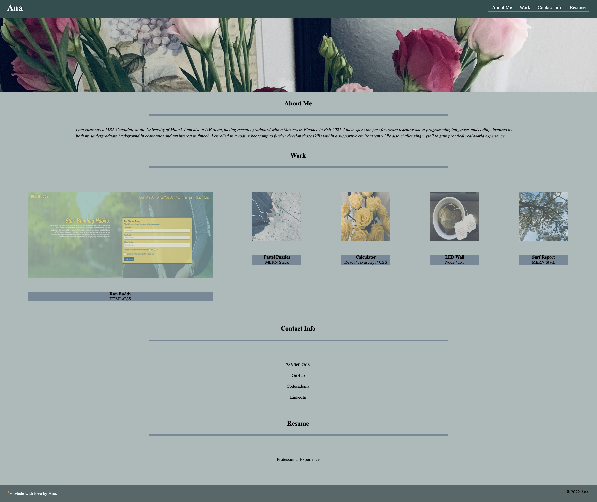
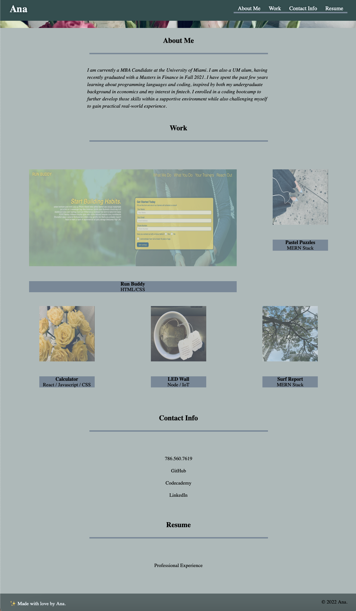

# Ana's Developer Portfolio

## Description

This website's source code was created from scratch. The purpose was to create a professional portfolio that showcased samples of our work. Placeholder images were used for the projects that have not been completed yet.

Both the HTML and CSS code adhere to various best practices not limited to: consolidating the source code selectors and properties, organizing the semantic structure, and including comments. Accessible alt attributes were added to the body images and all navigation links were formatted to function correctly. The application images link directly to the deployed applications.

The repository follows best practices for file structure, class/id naming conventions, code structure, comments, and commit messages. 

Link to deployed site (https://ams9220.github.io/professional-portfolio/).

## Installation

No installation is needed, once the user loads the deployed site URL they should be able to access the web application and all functionality features. 

## Usage

The purpose of this project was to showcase advanced CSS skills including flexbox, media queries, and CSS variables. Visual enhancements were also used to increase the clickable area size of links. Accessibility was considered across all design features.

The deployed application should look like the following : 

The website follows a responsive layout so the site view will change based on the screen size, as shown in the image below:

## Credits & License

The following assignment was completed as a Challenge as part of a Coding Boot Camp through the University of Miami. All images, content, and source code are originals and therefore considered intellectual property.

© 2022 Ana. Confidential and Proprietary. All Rights Reserved.

The projects contained within the portfolio are also covered by the following:

© 2021 Trilogy Education Services, LLC, a 2U, Inc. brand. Confidential and Proprietary. All Rights Reserved.